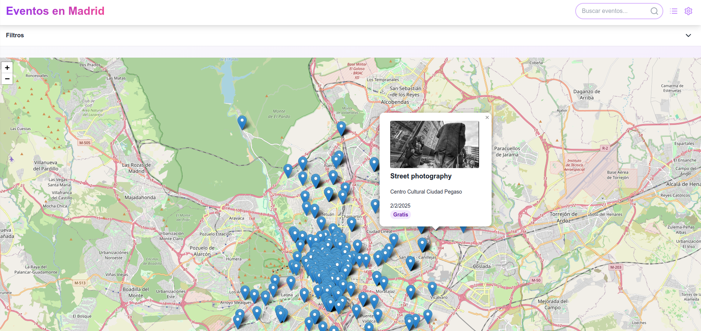

n# Madrid Events

## Project Description

Madrid Events is a web application designed to explore and manage events in Madrid. The platform allows users to discover a variety of local events, including their location, date, time, and relevant details. Users can navigate through different event categories, view detailed information, and check availability.

Main features:
- Event listing with detailed information
- Event filtering by categories
- Event search functionality
- Detailed event specifics
- Responsive and user-friendly interface

## Prerequisites

- Node.js (v18+)
- npm or yarn
- MongoDB installed and configured

## Installation

### Clone Repository
```bash
git clone https://github.com/[your-username]/madrid-events.git
cd madrid-events
```

### Install Dependencies

Navigate to each subdirectory (`madrid-events-backend` and `madrid-events-frontend`) and install their respective dependencies:

```bash
cd madrid-events-backend
npm install

cd ../madrid-events-frontend
npm install
cd .. # Return to the root directory
```

### Environment Configuration

#### Backend Environment Variables
Create a `.env` file in the backend directory with the following configuration:
```
# Database Configuration
MONGO_URI=mongodb://[username]:[password]@[host]:[port]/
DB_NAME=madrid-events
COLLECTION_NAME=events
PORT=5000
FRONTEND_URL=http://localhost:3000,http://localhost:3000/
NODE_ENV=development
```

#### Frontend Environment Variables
Create a `.env` file in the frontend directory with the following configuration:
```
NEXT_PUBLIC_API_HOST=http://localhost
NEXT_PUBLIC_API_PORT=5000
```

### MongoDB Configuration

Ensure MongoDB is installed and running. The application requires a MongoDB instance. You can install MongoDB following the official instructions for your operating system.

## Running Scripts

### From the Project Root Directory

You can use the following scripts from the root directory to manage both backend and frontend:

*   **Start both Backend and Frontend (Development):**
    ```bash
    npm start
    ```
    This will run both `npm run start-backend` and `npm run start-frontend` concurrently.

*   **Start only Backend (Development):**
    ```bash
    npm run start-backend
    ```

*   **Start only Frontend (Development):**
    ```bash
    npm run start-frontend
    ```

### From the `madrid-events-backend` Directory

Navigate to the `madrid-events-backend` directory:

*   **Start Backend (Development):**
    ```bash
    node server.js
    ```

### From the `madrid-events-frontend` Directory

Navigate to the `madrid-events-frontend` directory:

*   **Start Frontend (Development):**
    ```bash
    npm run dev
    ```

*   **Build Frontend for Production:**
    ```bash
    npm run build
    ```

*   **Start Frontend (Production - after build):**
    ```bash
    npm start
    ```

## Screenshots

### Main Dashboard


### Map View
